# DLW, Compensation, Variability, and Hypertrophy Cuts (Sections 1–8)

## Table of Contents
- [[#Proposed titles]]
- [[#Abstract]]
- [[#摘要（繁體中文）]]
- [[#1. Introduction: Why DLW changes the conversation]]
- [[#2. Measurement framework and key constructs in human energetics]]
- [[#3. Life-course patterns of energy expenditure]]
- [[#4. Energy compensation: mechanisms and evidence]]
- [[#5. Repeatability, predictiveness, and causality in TEE–adiposity relationships]]
- [[#6. Variability and sex differences: how wide are the error bars?]]
- [[#7. Methodological critique and sensitivity analysis]]
- [[#8. Translation to hypertrophy-preserving cuts in midlife]]


## Proposed titles
- **DLW-Constrained Cutting: Energy Expenditure, Compensation, and Knee-Friendly NEAT for Hypertrophy in Midlife** — probability 0.44
- **From Doubly Labeled Water to the Weight Room: A Measurement-First Framework for Hypertrophy-Preserving Fat Loss** — probability 0.33
- **Beyond ‘Calories Burned’: Lifespan TEE, Compensation, and Variability as Design Constraints for Hypertrophy Cuts** — probability 0.23

## Abstract
This review synthesizes four doubly labeled water (DLW)–anchored findings discussed in this thread—life-course patterns in total energy expenditure (TEE), partial energy compensation with increased activity, repeatability of adult TEE relative to body composition with weak short-term predictiveness for fat gain, and sex differences in expenditure variability—and translates them into design constraints for hypertrophy-preserving cuts in midlife. Across adulthood (~20–60), size-adjusted TEE is broadly stable, shifting the default explanation for stalled cuts away from ‘metabolic slowdown’ toward intake variance and behavioral drift, especially reduced non-exercise activity thermogenesis (NEAT). Compensation and heterogeneity make exercise-calorie arithmetic intrinsically noisy; therefore, diet should be the primary deficit lever, resistance training should preserve the hypertrophic signal via performance anchors, and NEAT should be scheduled and tracked to prevent drift. The review formalizes key methodological sensitivities (part–whole regression, regression dilution, derived-variable coupling, fixed-TEF assumptions, FFM non-uniformity, and pooled-database heterogeneity) and proposes a practical control-system approach with knee-friendly NEAT options (standing breaks, flat micro-walks, low-intensity cycling) and trend-based decision rules.

## 摘要（繁體中文）
本文綜述本次討論中四項以雙重標記水（DLW）為核心的證據：全日總能量消耗（TEE）的生命歷程型態、活動增加時的部分能量補償（compensation）、成人TEE相對於體組成的可重複性（repeatability）但對短期增脂的預測力有限、以及能量消耗在族群層面的性別變異性差異，並將其轉化為中年「保肌減脂」的設計約束。在約20–60歲，校正體型/體組成後的TEE大致穩定，因而減脂停滯的預設解釋應從「代謝變慢」轉向攝食變異與行為漂移，尤其是非運動活動產熱（NEAT）下降。補償效應與高度異質性使「運動熱量帳本」本質上噪音很大；因此，飲食應作為主要赤字槓桿，阻力訓練以表現錨點維持增肌訊號，而NEAT需被制度化安排與追蹤以防漂移。本文並整理主要方法學敏感點（整體—部分回歸、回歸稀釋、推導變數耦合、固定TEF假設、FFM非均質性、資料庫彙整異質性），提出以回饋控制為核心的實務框架，包含護膝NEAT選項（站立休息、短平地分段走路、低強度踩車）與趨勢導向的調整規則。

# 1. Introduction: Why DLW changes the conversation

Energy expenditure sits at the center of nearly every explanation people give for weight gain, fat loss failure, and the perceived “inevitability” of metabolic decline with age. Most of those explanations are not constrained by measurement; they are constrained by narrative convenience. Doubly labeled water (DLW) is disruptive because it forces a distinction between (a) what humans *say* their bodies are doing and (b) what their bodies are *measurably* doing in free-living conditions. That constraint matters for anyone running a hypertrophy-focused cut: if your conceptual model of energy expenditure is wrong, you will pick the wrong levers (typically, more “calorie-burning” exercise) and ignore the right ones (typically, intake control, NEAT drift, recovery, and adherence mechanics).

The DLW-centered papers discussed in this thread collectively narrow the plausible space in three ways. First, they reduce the room for dramatic midlife “metabolic collapse” claims by emphasizing relatively stable adult expenditure after appropriate size/composition adjustment. Second, they show why exercise-calorie arithmetic is systematically overtrusted by pointing to partial compensation and behavioral drift. Third, they move the discussion away from “metabolism as destiny” by showing that even when adult expenditure is trait-like, short-horizon changes in fatness are not strongly predicted by baseline expenditure alone. The outcome is not nihilism (“nothing matters”), but a more demanding standard: your fat-loss plan must be robust to compensation, variance, and measurement noise.

## 1.1 Common myths that survive because measurement is absent

**Myth 1: “Metabolism starts slowing in your 30s/40s, so cutting becomes fundamentally different.”**  
This claim persists because it fits lived experience (“I used to eat more”) and provides an exogenous villain (“aging”) rather than endogenous variables (sleep debt, lower NEAT, higher intake density, more sedentary work). The measurement-constrained alternative is blunt: if adult expenditure is relatively stable for your size/composition across midlife, then the large swings people attribute to “metabolic slowdown” are more likely explained by **behavioral allocation** (less movement, fewer steps, fewer standing breaks, less spontaneous activity), **body composition drift** (less lean mass, more fat mass), and **appetite regulation** (more palatable diets, less satiety) than by a sudden drop in basal physiology. This matters because if you start your cut by chasing a bigger and bigger exercise deficit, you may provoke fatigue and compensate by moving less, producing exactly the stall you feared.

**Myth 2: “Exercise calories are additive; you can bank them.”**  
Most cut plans implicitly assume a linear model: add 300 kcal/day of cardio, keep diet constant, lose ~0.3–0.4 kg/week forever. Real organisms are not linear systems. They shift the allocation of energy and behavior. Even if the physiological mechanisms are debated, the practical phenomenon is familiar: people who add exercise often also (i) sit more, (ii) fidget less, (iii) change appetite and intake, (iv) reduce “incidental movement,” and (v) sometimes downshift other expenditure components. Treating the treadmill display as a balance-sheet credit is a category error: it confuses **gross exercise expenditure** with **net change in TEE**.

**Myth 3: “If you’re gaining fat, your metabolism must be low (or ‘damaged’).”**  
This is a moralized story disguised as physiology. It ignores that short-horizon weight/fat change is dominated by intake, adherence variance, fluid/glycogen shifts, and NEAT drift. A stable, repeatable expenditure trait does not automatically translate into predictive power for short-term fat gain, because the system’s dominant variance often sits on the intake side and the behavior side. In other words: you can have a “normal” expenditure profile and still gain fat if intake is higher than expenditure, and you can have a “high” expenditure profile and still stall if intake increases or movement decreases.

**Myth 4: “One calculator gives the answer for everyone.”**  
Population equations are not individualized models; they are averages with error bars. When expenditure variability differs across groups, lifestyles, and constraints, calculators become starting guesses, not ground truth. Your plan must be built to self-correct from your own trend data (scale + waist + performance), rather than to “follow the number.”

### Figure 1. Myth-to-measurement map (schematic)

```mermaid
flowchart TD
A[Claim / Myth] --> B{Measurable with DLW?}
B -->|Yes| C[Quantify TEE in free-living conditions]
B -->|Partly| D[Need additional measures\n(BEE, activity sensors, intake)]
B -->|No| E[Remain speculative\n(or confounded)]
C --> F{Does it imply a coaching lever?}
F -->|Often| G[Diet control / NEAT protection /\ntraining quality / recovery]
F -->|Sometimes| H[Medical evaluation if symptoms\nsuggest endocrine/systemic disease]
```

## 1.2 What DLW measures—and what it does not

DLW estimates **total energy expenditure over days** in free-living conditions by tracking isotope elimination. For practical purposes, it answers a narrow but powerful question: *How much energy did this person expend per day, on average, over the measurement interval?* That narrowness is a feature. It bypasses self-report, gym-machine guesses, and most day-to-day noise. It is the closest we have to a “thermostat reading” for the body’s real-world energy throughput.

But DLW is not an oracle, and a DLW-anchored paper can still overreach if it blurs the boundaries between measurement and inference. DLW does **not** directly tell you:
- how much of TEE was **basal** vs **activity** vs **thermic effect of food**;
- whether changes in TEE were driven by **more movement** or by **changing tissue metabolism**;
- whether any association implies **causality** (especially in cross-sectional pooled datasets);
- what happened on a **day-by-day** basis (DLW averages over the interval).

As soon as researchers decompose TEE into components (e.g., basal vs activity), they typically introduce additional measurement error (indirect calorimetry protocol variance) and assumptions (often a fixed thermic effect of food). As soon as they use regression slopes to infer compensation, they face classic threats: **part–whole regression** structure, **regression dilution** from measurement error, and **mathematical coupling** when one variable is constructed from another (e.g., AEE as a function of TEE and BEE). Those threats don’t nullify the findings; they change what you should believe with high confidence versus what you should treat as approximate.

### Table 1. Key constructs used in this review (operational definitions and coaching relevance)

| Construct | Operational definition (typical in DLW studies) | What it captures | Main coaching relevance | Typical pitfalls |
|---|---|---|---|---|
| TEE | Mean total daily energy expenditure over interval (DLW) | Whole-system energy throughput | Sets maintenance/deficit reality | Interpreting short-term changes as “metabolic” rather than behavioral |
| BEE / RMR | Basal/resting expenditure (indirect calorimetry) | Baseline tissue/organ costs | Recovery, dieting aggressiveness | Protocol inconsistency; measurement error |
| TEF | Thermic effect of food | Digestion/assimilation cost | Macro composition affects satiety more than TEE | Often assumed constant (e.g., 10%) |
| AEE / PAEE | Often derived: AEE ≈ 0.9×TEE − BEE | Activity-related component | Explains why steps matter | Derived-variable coupling; compounding errors |
| NEAT | Non-exercise activity thermogenesis | Incidental movement, posture, micro-activity | The “silent deficit killer” during cuts | Drifts down when fatigued; not captured by gym logs |
| “Adjusted TEE” | TEE normalized for FFM/FM/age/sex (model-based) | Expenditure relative to body composition | Helps interpret “metabolism” claims | Depends on model form; FFM is not metabolically uniform |

## 1.3 Scope and organizing questions of this review

This review does not attempt to re-litigate every debate in obesity science. It targets a narrower objective: to connect DLW-constrained findings to *coachable decisions* in a hypertrophy-focused cut—particularly where joint limitations (e.g., knee osteoarthritis) constrain high-step or high-impact strategies.

The organizing questions are:

1) **How stable is adult energy expenditure for a given body size/composition, and what does “stability” rule out?**  
If adult adjusted expenditure is stable across midlife, you should stop blaming age as the primary cause of cut failure and start measuring the controllables.

2) **How large and how reliable is “energy compensation,” and which parts are solid versus estimator-dependent?**  
Even if the exact percentage is uncertain, the direction is operationally decisive: you must assume that added exercise will be partially offset unless you actively prevent drift.

3) **If adult TEE is repeatable, why doesn’t it strongly predict short-term fat gain?**  
Because short-term fatness is governed by the variance of intake and behavior; the presence of a stable trait does not guarantee predictive dominance.

4) **How should variability (including sex differences in variance) change the design of your plan?**  
It pushes you toward individualized calibration, trend-based decisions, and conservative reliance on calculators.

5) **What does “best practice” look like for a hypertrophy cut when the knee cannot tolerate high-impact NEAT?**  
It requires a **knee-friendly NEAT protocol**, deliberate tracking of step drift, and decision rules that preserve training quality over maximal daily energy burn.

Section 2 formalizes the measurement and modeling frame; Sections 3–6 synthesize the empirical patterns (life-course stability, compensation, repeatability, variability); Section 7 stress-tests inference; Sections 8–9 translate the evidence into a cut framework and a knee-safe NEAT implementation with drift detection.


# 2. Measurement framework and key constructs in human energetics

A DLW-anchored view of metabolism starts by refusing two shortcuts: (i) treating energy expenditure as a single number with a single cause, and (ii) treating body size adjustment as “divide by body weight.” Both shortcuts are convenient and both are wrong often enough to derail interpretation. This section builds the working measurement model used throughout the review: what is measured directly, what is inferred, what is derived by algebra, and where the main statistical traps sit.

## 2.1 Components and accounting identities: TEE, BEE/RMR, TEF, AEE/PAEE, NEAT

At a conceptual level, daily energy expenditure can be decomposed as:

- **TEE** (total energy expenditure): the whole-system total in free living
- **BEE/RMR** (basal/resting energy expenditure): the resting “overhead”
- **TEF** (thermic effect of food): digestion/assimilation costs
- **AEE/PAEE** (activity energy expenditure): movement/posture and exercise
- **NEAT** (non-exercise activity thermogenesis): the non-training portion of AEE

A common accounting identity is:

\[
\text{TEE} = \text{BEE} + \text{AEE} + \text{TEF}
\]

However, the moment you try to estimate **AEE** from DLW and calorimetry you are no longer simply “using an identity,” you are **building an estimator** with assumptions. In the papers discussed in this thread, AEE is often derived as:

\[
\text{AEE} \approx 0.9 \times \text{TEE} - \text{BEE}
\]

The 0.9 multiplier encodes an assumption that **TEF ≈ 10% of TEE**. That assumption is serviceable as a population average, but it is not invariant: TEF shifts with macronutrient composition (protein higher), meal timing, and inter-individual physiology. Treating TEF as fixed compresses one source of variance into the AEE residual and can distort correlations if TEF differs systematically across groups.

A second distinction matters for training application: **NEAT is not “extra.”** It is often the dominant adjustable component of AEE outside formal exercise. In a cut, NEAT is also the component most likely to drift downward silently via fatigue, reduced fidgeting, fewer short trips, and more sitting—i.e., the behavioral side of “compensation.” The practical message is methodological: you cannot reason about AEE from gym sessions alone; you must reason about the whole day.

### Figure 2. Measurement-to-construct pipeline (DLW-centric)

```mermaid
flowchart LR
A[DLW isotopes\n(urine/saliva samples)] --> B[TEE over interval\n(kJ/day or MJ/day)]
C[Indirect calorimetry] --> D[BEE/RMR\n(kJ/day)]
E[Body composition\n(isotope dilution / DXA)] --> F[FFM, FM]
B --> G{Decomposition}
D --> G
G -->|Assume TEF ~10%| H[AEE ≈ 0.9×TEE − BEE]
H --> I[NEAT + Exercise\n(not separable without sensors)]
J[Accelerometry / HR] --> I
K[Diet logs / controlled feeding] --> L[Intake & TEF variability]
```

This pipeline highlights a core theme for the review: DLW provides a robust anchor for **TEE**, but component-level claims (AEE vs BEE tradeoffs, compensation magnitude) depend on additional measurement quality and assumptions.

## 2.2 Scaling and adjustment: allometry, body composition, and why “per kg” misleads

Most errors in public metabolism talk start with the same mistake: turning a nonlinear relationship into a ratio. If TEE scaled linearly with body mass, “kcal/kg” might be harmless. But TEE does not scale linearly with mass, and even when it scales tightly with **fat-free mass**, the exponent can be less than 1, implying diminishing returns per kg of tissue. One of the papers we discussed uses an allometric relationship of the form:

\[
\text{TEE} = a \times \text{FFM}^{b}
\quad\text{with}\quad b<1
\]

When \( b<1 \), dividing by FFM (or body mass) introduces systematic bias: heavier individuals will appear “metabolically lower per kg” even if they are exactly on the expected curve. The correct adjustment is not ratio scaling; it is model-based normalization, typically via log-linear regression:

\[
\ln(\text{TEE}) = \alpha + \beta_1 \ln(\text{FFM}) + \beta_2 \ln(\text{FM}) + \beta_3 \text{Age} + \beta_4 \text{Sex} + \varepsilon
\]

From such models, authors define an “**adjusted TEE**” as observed relative to predicted (e.g., \( \text{Observed}/\text{Predicted} \times 100 \)). This yields a size/composition-normalized measure intended to answer: *Does this person expend more or less energy than expected for their body composition and demographics?*

Two cautions are critical:

1) **FFM is not metabolically uniform.**  
Organs (brain, liver, heart, kidney) have far higher metabolic rates per unit mass than skeletal muscle. Aging and development change organ proportions and muscle “quality” (fat infiltration, hydration shifts). Thus, adjusting only on total FFM can leave residual structure that is biological, not statistical noise.

2) **Adjustment models encode assumptions.**  
The choice of predictors (FFM and FM vs total mass, nonlinearities, interactions) changes what “adjusted” means. An adjusted residual is not a direct measurement; it is a measurement filtered through a model.

### Table 2. Common adjustment strategies and their failure modes

| Strategy | Typical form | Why people use it | What it gets wrong | When it’s acceptable |
|---|---|---|---|---|
| Ratio scaling | TEE/kg or TEE/FFM | Simple, intuitive | Biased under nonlinear scaling; confounds size with “efficiency” | Rarely; exploratory only |
| Linear regression | TEE ~ FFM + FM + age + sex | Better size control | Assumes linearity; ignores heteroskedasticity | Often acceptable with diagnostics |
| Log-allometric | ln(TEE) ~ ln(FFM) + ln(FM) + covariates | Handles power-law scaling | Depends on correct functional form; interpretation less intuitive | Strong default for DLW meta-data |
| Residualization | Adjusted TEE = observed/predicted | Produces a single normalized score | “Adjusted” is model-dependent; residuals may hide meaningful structure (organ composition) | Useful for repeatability/variance questions |
| Mixed models | Add random effects (ID, study/country) | Handles repeated measures & clustering | Sensitive to random-effect specification; pooled heterogeneity remains | Essential for databases |

## 2.3 Sources of variance: biology, behavior, environment, and measurement error

Inter-individual differences in TEE arise from at least four layers, each with different implications for training and cutting:

1) **Biological structure:** body size, body composition, organ proportions, endocrine tone, inflammation.
2) **Behavioral allocation:** occupation, commuting, spontaneous movement, training volume, sedentary time.
3) **Environmental constraints:** built environment, climate, cultural norms, socioeconomic structure.
4) **Measurement and estimator error:** protocol variability, device calibration, and derived-variable coupling.

What matters is not merely that variance exists, but that **variance is not all “metabolic.”** For a hypertrophy cut, the dominant actionable variance often sits in layer 2 (behavioral allocation) and the intake side (not measured by DLW), not in immutable basal physiology. This is the justification for a control-system approach: track the variables that drift (steps, sitting time, appetite), and adjust the plan accordingly.

### Figure 3. Variance decomposition (conceptual): what changes your outcome?

```mermaid
flowchart TD
A[Observed weight/fat change] --> B[Intake variance\n(adherence, appetite, logging error)]
A --> C[Expenditure variance]
C --> D[Body composition & organs]
C --> E[Behavioral allocation\n(NEAT drift, sedentary time)]
C --> F[Training load & recovery]
C --> G[Measurement/estimator error]
E --> H[Steps, standing breaks,\nincidental movement]
F --> I[Fatigue, sleep, pain constraints]
```

This framing explains why baseline expenditure can be repeatable but weakly predictive of short-horizon fat gain: the predictive signal is swamped by intake variance and behavioral drift.

## 2.4 Statistical hazards that recur in DLW-derived analyses

The papers in this thread do not all commit the same inferential sins, but they cluster around a few recurring hazards. These are not pedantic; they change how much confidence you should assign to quantitative claims like “compensation is 28%” or “AEE is negatively correlated with BEE.”

### 2.4.1 Part–whole regression (TEE on BEE)
Regressing **TEE** on **BEE** is tempting because BEE is a large component of TEE. Under an additive model, one might expect a slope near 1. But this is a regression of a sum on one of its addends, and its slope is sensitive to:
- measurement error in the predictor (BEE),
- covariance between components,
- the distribution of other components across the sample.

A slope below 1 can reflect genuine compensation, but it can also reflect attenuation (regression dilution) if BEE is noisy or if the other components covary negatively with BEE for reasons unrelated to a causal tradeoff.

### 2.4.2 Derived-variable coupling (AEE = 0.9×TEE − BEE)
If AEE is computed by subtracting BEE, then AEE and BEE are mechanically linked. Even if physiology were independent, the algebra creates negative covariance and amplifies measurement error. Therefore, the AEE~BEE regression is not an independent corroboration of TEE~BEE—both are entangled by definition.

### 2.4.3 TEF fixed proportion assumption
The 10% TEF convention is a convenience prior. When diet composition differs systematically across individuals, TEF becomes an unmodeled source of error. This matters most when TEF variability correlates with adiposity, sex, or training status.

### 2.4.4 Pooled database heterogeneity
Large DLW databases combine many studies with different recruitment frames and protocols. Random effects for “country” help, but do not fully solve:
- study-level protocol differences,
- cohort selection (volunteers vs population samples),
- different measurement eras and devices.

Variance comparisons and subtle interaction claims are especially sensitive to study-mix.

### Table 3. Threats to validity that matter for coaching translation

| Hazard | Where it shows up | Typical direction of bias | Why it matters in practice | How to mitigate (in reviews / in your plan) |
|---|---|---|---|---|
| Regression dilution | slopes using BEE as predictor | slopes shrink toward 0 | “Compensation %” may be overstated/understated | sensitivity analyses; rely on direction more than exact % |
| Part–whole regression | TEE ~ BEE | non-intuitive slopes | false certainty about tradeoffs | prefer designs with independent activity measures |
| Derived-variable coupling | AEE = 0.9×TEE − BEE | induces negative correlations | can “manufacture” tradeoffs | use steps/bike minutes as operational activity targets |
| Fixed TEF | AEE derivations | misallocates variance to AEE | can distort subgroup comparisons | treat AEE as approximate; consider diet composition |
| Pooled heterogeneity | database meta-analyses | confounding by cohort/protocol | generalizability of effect sizes | prioritize within-cohort replication; calibrate personally |

## 2.5 A coaching-oriented measurement stance: what to treat as “hard,” “soft,” and “actionable”

A useful way to keep your plan intellectually honest is to classify variables by evidential hardness and actionability:

- **Hard(ish):** DLW-derived TEE; long-window trend weight; waist circumference trend.
- **Medium:** BEE/RMR measured well under standardized conditions; step counts from a stable device.
- **Soft:** derived AEE from 0.9×TEE − BEE; single-day scale weight; “calories burned” estimates.
- **Actionable:** intake targets, meal structure, step/bike schedules, training volume distribution, sleep routine.

For hypertrophy-preserving cuts—especially with knee constraints—this stance implies a specific operating policy: treat **exercise calories** as a health/training lever, treat **NEAT** as a stability lever, treat **diet** as the primary deficit lever, and treat **trend-based metrics** as the arbiter of whether your model is working. This review will return to that policy in Sections 8–9, but the logic begins here: measurement discipline is what prevents you from chasing the wrong signal.


# 3. Life-course patterns of energy expenditure

The life-course question is deceptively simple: *how does total energy expenditure (TEE) change with age?* The reason it stays contentious is that “TEE with age” is confounded by growth, changes in body composition, cohort effects, and sloppy scaling practices (especially per-kg ratios). The DLW life-course analysis discussed in this thread addresses these confounds by anchoring TEE to free-living measurement and emphasizing allometric adjustment to fat-free mass (FFM) and fat mass (FM), rather than naïve ratio scaling. This section develops three linked claims: (i) the empirical phase structure of adjusted TEE across the lifespan, (ii) a practical translation into kcal/day magnitudes, and (iii) what “adult stability” does—and does not—license you to conclude.

## 3.1 A four-phase model: infancy surge, youth decline, adult plateau, late-life decline

A central result of the DLW life-course analysis is that once you account for body composition using an allometric relationship between TEE and FFM, the age pattern is not a monotone “decline with age” but a segmented trajectory with distinct phases.

### Phase 1: Neonatal baseline and infancy acceleration (≈0–1 year)
The striking feature is not merely that infants have high absolute expenditure for their size, but that **adjusted** expenditure rises rapidly in the first year, reaching a peak around 1 year of age substantially above adult reference levels. The most defensible interpretation is mechanistic pluralism: rapid tissue growth, high relative organ metabolic demand (especially brain in early life), thermoregulation, and high turnover costs plausibly contribute. What matters for this review is methodological: the peak remains after size/composition adjustment, implying it is not just “small bodies have different per-kg costs,” but a genuinely distinct metabolic stage.

### Phase 2: Juvenile decline to adult level (≈1–20 years)
From the infancy peak, adjusted expenditure declines steadily through childhood and adolescence, arriving at adult-like levels around late adolescence/early adulthood. One empirically consequential claim is the absence of a distinct pubertal “bump” in adjusted expenditure; puberty changes body composition and growth rate, but the adjusted curve does not show a compensatory spike once modeled this way.

### Phase 3: Adult plateau (≈20–60 years)
The most socially disruptive claim is that **adjusted TEE is broadly stable across adulthood**, roughly between 20 and 60. This does not mean individuals have identical expenditure—only that the *mean age trend* of size-adjusted expenditure is relatively flat in that window. For midlife hypertrophy cutting, this is a constraint on explanation: if your maintenance intake seems to drop, you should first suspect changes in NEAT, lifestyle, sleep, injury constraints, or composition drift rather than a strong biological age effect on TEE.

### Phase 4: Later-life decline (≈60+)
After around 60, the analysis reports a progressive decline in adjusted expenditure, with substantially lower adjusted levels by the 90s. A key methodological caveat remains: even “FFM-adjusted” models can partially conflate changes in **FFM composition** (organ proportion, muscle quality, hydration) with changes in **tissue metabolic rate**. Still, the direction—late-life downshift—appears robust within the model.

### Figure 3. Life-course schematic with interpretive annotations (conceptual)
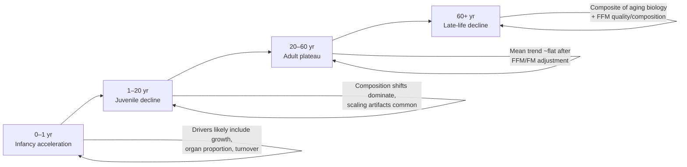

## 3.2 Translating adjusted findings into kcal/day: typical adult magnitudes and the practical size of “late-life decline”

The life-course paper’s allometric framework provides a route to “back-of-the-envelope but defensible” translations. The paper reports a power-law relationship between TEE and FFM (example form: **TEE = 0.677 × FFM^0.708** in MJ/day). Converting MJ/day to kcal/day uses a physical constant: **1 MJ/day ≈ 239 kcal/day**.

### Table 3. Worked examples: FFM → TEE → kcal/day (illustrative)
Assumptions below are only to produce concrete numbers (not presented as “population averages”).

| Example | Body mass | Body fat % | FFM (kg) | TEE (MJ/day) using 0.677×FFM^0.708 | TEE (kcal/day) |
|---|---:|---:|---:|---:|---:|
| “Typical male” | 80 kg | 20% | 64.0 | ~12.86 | ~3,074 |
| “Typical female” | 65 kg | 30% | 45.5 | ~10.10 | ~2,415 |

### Table 4. What −0.7%/year means from 60 to 90 (holding composition constant)
| Age | Multiplier vs 60 | Male example (kcal/day) | Female example (kcal/day) |
|---:|---:|---:|---:|
| 60 | 1.000 | 3,074 | 2,415 |
| 70 | 0.932 | 2,866 (−209) | 2,251 (−164) |
| 80 | 0.869 | 2,672 (−403) | 2,098 (−316) |
| 90 | 0.810 | 2,490 (−584) | 1,956 (−459) |

## 3.3 What “adult stability” does and does not mean

The adult plateau claim (≈20–60) is the most important constraint for midlife training decisions, but it is also the easiest to misuse.

### What it *does* mean
- Within the adjustment model, the **average age trend** of TEE in adulthood is near-flat.
- Therefore, large perceived drops in “metabolism” in the 30s–50s are more plausibly attributable to **behavioral allocation**, **composition drift**, and **intake changes**, rather than a strong intrinsic age effect on TEE.

### What it does *not* mean
- It does not mean individuals do not change: injury, job changes, sleep, stress, and training volume can shift both activity and intake dramatically.
- It does not mean the model has eliminated all confounding: pooled cross-sectional datasets are vulnerable to **cohort effects**.
- It does not mean “FFM adjustment equals biology adjustment”: because FFM is not metabolically homogeneous, residual age effects can reflect changing organ fractions and muscle quality.

### Figure 5. Interpretation guardrail: from population curve to individual plan
```mermaid
flowchart TD
A[Population-level adjusted TEE curve\n(adult plateau)] --> B[Individual reality\n(NEAT drift, intake variance,\nconstraints like knee OA)]
B --> C[Plan design]
C --> D[Diet establishes deficit]
C --> E[Resistance training preserves signal]
C --> F[NEAT protocol stabilizes movement]
D --> G[Trend-based adjustment rules\n(2–3 week windows)]
E --> G
F --> G
```


# 4. Energy compensation: mechanisms and evidence

The intuition most lifters and dieters bring to energy expenditure is additive: if you add 300 kcal/day of cardio, you should—absent diet change—create a 300 kcal/day larger deficit. The compensation literature exists because this repeatedly fails in real humans. The key scientific question is not whether exercise “burns calories” (it does), but whether an imposed increase in activity produces an equivalent increase in **total energy expenditure (TEE)** at the whole-day level, or whether the organism offsets some of that increase by shifting behavior and/or physiology.

## 4.1 Additive vs constrained expenditure: what each model predicts

### Additive model
\[
\Delta \text{TEE} \approx \Delta \text{AEE}
\]

### Constrained / compensatory model
\[
\Delta \text{TEE} < \Delta \text{AEE}
\]

### Figure 6. Two competing expenditure models (conceptual)
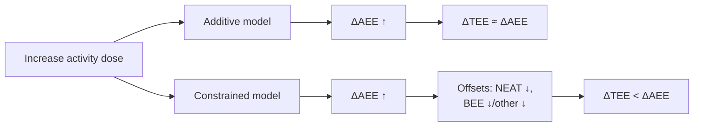

## 4.2 Empirical test in DLW + calorimetry datasets: evidence consistent with partial compensation

The compensation paper uses paired measures: **TEE** from DLW and **BEE** from indirect calorimetry. They infer compensation by examining how TEE scales with BEE under covariate adjustment, reporting a slope below the additive expectation and interpreting it as partial compensation (average magnitude ~28% by their estimator), with stronger compensation at higher adiposity and additional within-individual analysis in a small elderly cohort.

### Table 5. How constructs are operationalized
| Construct | How it is obtained | Measured vs assumed | Inference risk |
|---|---|---|---|
| TEE | DLW | measured | low |
| BEE | Calorimetry | measured | protocol-sensitive |
| AEE | 0.9×TEE − BEE | assumes TEF≈10% | coupling |
| “Compensation %” | 1 − slope(TEE~BEE) | inferred | over-precision |

## 4.3 Methodological critique: what is robust vs estimator-sensitive

### Figure 7. Compensation estimator pitfalls (schematic)
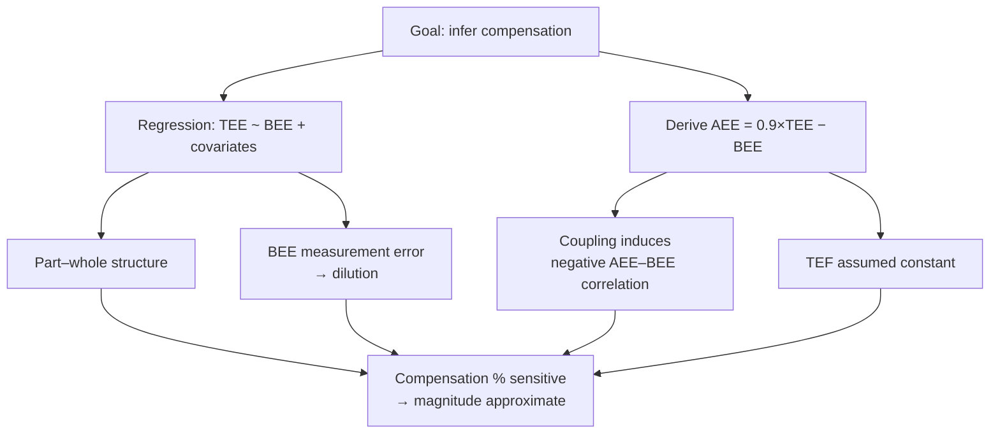

### Table 6. What to believe strongly vs cautiously
| Claim | Support level | Reason |
|---|---|---|
| Activity increases often fail to translate one-for-one into higher TEE | High | DLW evidence consistent with partial compensation |
| NEAT drift contributes materially | High (pragmatic) | Observable behavior; aligns with constrained models |
| Exact compensation is ~28% | Moderate | estimator-sensitive |
| Compensation stronger at higher adiposity | Moderate | plausible; sensitive to assumptions |
| Compensation mainly within-individual | Low–Moderate | small, age-restricted longitudinal sample |

## 4.4 Mechanisms that matter in real cuts

- **NEAT downshift:** reduced incidental movement during fatigue/deficits.
- **Appetite/intake compensation:** increased hunger and intake erase the deficit.
- **Physiological economizing:** possible basal/other downshifts.

## 4.5 Practical implications

Design cuts to be robust to compensation: don’t default to eating back exercise calories; schedule and track NEAT; protect recovery.

### Figure 8. Compensation-aware cut control loop (schematic)
```mermaid
flowchart TD
A[Set diet deficit] --> B[Run training\n(maintain tension)]
B --> C[Schedule NEAT\n(standing + micro-walk + easy bike)]
C --> D[Track 7-day medians\n(steps, bike mins, weight, waist,\nknee symptoms)]
D --> E{Stall or drift?}
E -->|Steps down ≥10%| F[Restore NEAT\n(add micro-walk or bike)]
E -->|NEAT stable, trend flat| G[Adjust diet −150 to −250 kcal/day]
E -->|Knee flare / performance crash| H[Reduce fatigue/deficit\nswap walking→bike]
F --> D
G --> D
H --> D
```


# 5. Repeatability, predictiveness, and causality in TEE–adiposity relationships

Adult adjusted TEE can behave like a moderately stable trait across time, yet that trait often fails to predict short-horizon changes in body weight or body fat in the way lay reasoning expects (“low burners gain; high burners stay lean”). The repeatability paper targets (i) whether adjusted TEE is repeatable within individuals and (ii) whether adjusted TEE relates to short-term changes in body composition.

## 5.1 Adult adjusted TEE as a repeatable trait

Within this framework, adults show repeatability around **R ≈ 0.64**, while young children show little repeatability.

### Table 7. Repeatability: operational meaning and coaching translation
| Concept | Formal meaning | Not | Coaching translation |
|---|---|---|---|
| Repeatability (R/ICC) | Between-person variance fraction | destiny | calibrate maintenance |
| High R in adults | rank-order stability | predicts short-term fat gain | trait-like ≠ dominant predictor |
| Low R in children | within-child variance dominates | no physiology | development changes system |

## 5.2 Why stable traits can be weak short-term predictors

Prediction requires signal dominance; intake variance, NEAT drift, and fluid noise can swamp the expenditure signal.

### Figure 9. “Stable but non-predictive” logic
```mermaid
flowchart TD
A[Baseline adjusted TEE\n(stable trait)] --> B[True contribution]
C[Intake variance] --> D[Dominant driver]
E[NEAT drift] --> D
B --> F[Observed Δweight/Δfat]
D --> F
G[Fluid/glycogen noise] --> F
```

## 5.3 Within-person vs between-person effects

### Figure 10. Between vs within causal diagrams
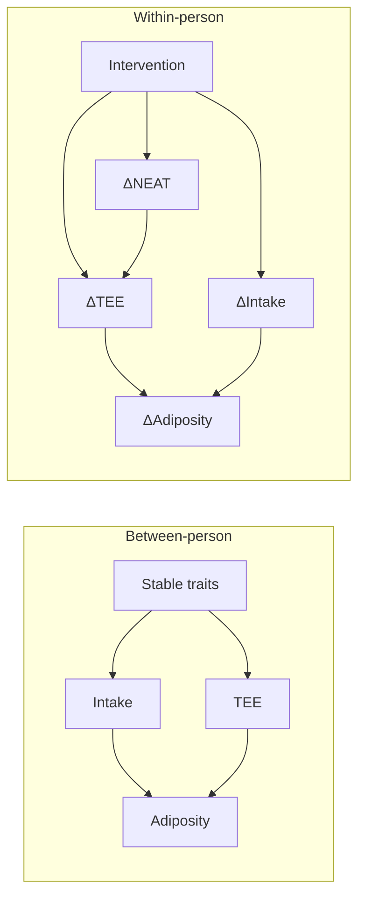

## 5.4 Adjustment and causal pathways

Adjustment on FFM/FM answers “above/below expected” but can remove mass-mediated pathways and is model-dependent.

### Table 8. What different TEE variables imply
| Variable | Best question | Misleads because |
|---|---|---|
| Absolute TEE | “how many kcal/day?” | confounded by size |
| TEE/kg | per mass | biased |
| Adjusted TEE | above/below expected | model-dependent residual |
| ΔTEE | did expenditure change | timing ambiguity |

## 5.5 Trait vs delta matters for cuts

### Figure 11. Trait vs delta
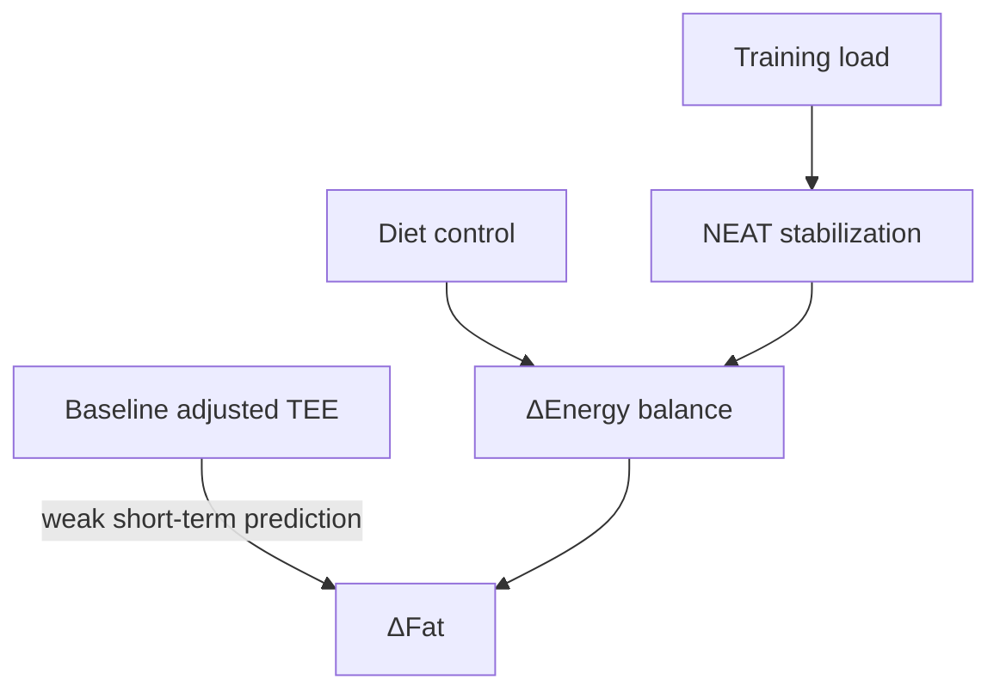

## 5.6 Decision rules implied

### Table 9. Practical decision rules
| Observation | Plausible driver | First adjustment |
|---|---|---|
| Weight/waist flat, steps down | NEAT drift | restore NEAT |
| Flat, NEAT stable | intake high | reduce intake |
| Performance down, knee worse | deficit too aggressive | reduce deficit; walk→bike |


# 6. Variability and sex differences: how wide are the error bars?

Population equations hide dispersion. The variability paper argues males show much higher inter-individual variance than females in TEE/BEE/AEE even after covariate adjustment, with modifiers by age and geography.

## 6.1 What is being estimated

### Table 10. Measures and variance meaning
| Measure | Obtained | Variance reflects | Pitfalls |
|---|---|---|---|
| TEE | DLW | biology+behavior | study-mix |
| BEE | calorimetry | resting+protocol | protocol variance |
| AEE | 0.9×TEE−BEE | activity+TEF noise | coupling |

## 6.2 Results: variance ratios persist after adjustment

### Figure 12. Variance ratio schematic across model sets
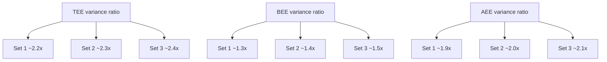

## 6.3 Interpretation for practice

Use calculators as priors; calibrate with trends; treat sex effects as dispersion not destiny.

## 6.4 Variance-aware plan rules

### Table 11. Error-bar aware rules
| Problem | Naïve | Variance-aware |
|---|---|---|
| Maintenance | trust calculator | calibrate via trends |
| Add cardio | assume linear | assume compensation |
| Stall | “metabolism” | audit drift/intake |
| Adjust | many tweaks | one change at a time |

## 6.5 Caveats

### Figure 13. Why variance ratios can be mixed (conceptual)
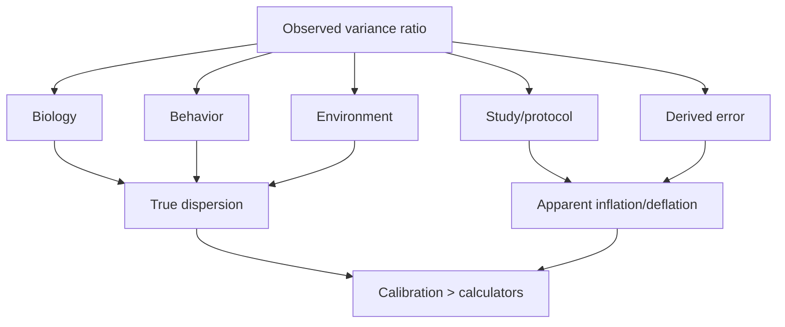


# 7. Methodological critique and sensitivity analysis

DLW constrains TEE, but decompositions and slopes remain vulnerable. The key is to separate hard measurement from inference.

## 7.1 Threat model
- Part–whole regression
- Regression dilution
- Derived-variable coupling
- Fixed TEF assumptions
- FFM non-uniformity
- Pooled heterogeneity
- Time-horizon mismatch

## 7.2 Compensation estimates: slope fragility

### Figure 14. Slope <1 not unique
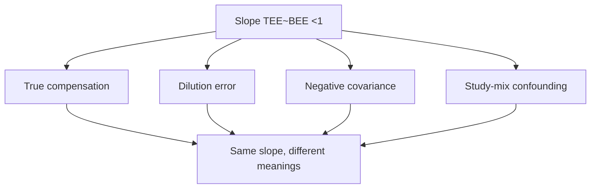

## 7.3 Coupling in derived AEE

### Table 12. Measured vs computed vs assumed
| Quantity | Status | Assumptions | Risk |
|---|---|---|---|
| TEE | measured | isotope model | low |
| BEE | measured | protocol | medium |
| AEE | computed | TEF≈10% | coupling |
| Compensation % | inferred | slope meaning | over-precision |

## 7.4 TEF assumption sensitivity
Treat TEF as a range; test robustness.

## 7.5 FFM non-uniformity
FFM is a mixture of organs/muscle/other; residual “adjusted” effects can be compositional.

### Figure 15. FFM mixture
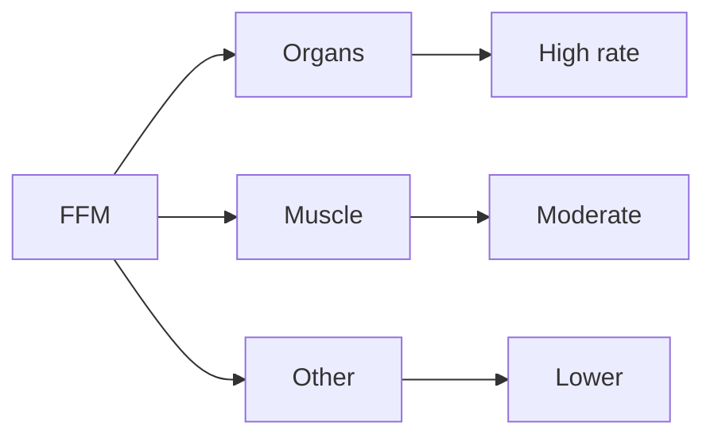

## 7.6 Pooled heterogeneity

### Table 13. Pooled threats
| Threat | Effect | Affects | Check |
|---|---|---|---|
| Study-mix | biases variance/interactions | sex variance, adiposity interactions | within-cohort replication |
| Protocol | adds noise | BEE/AEE | restrict protocols |
| Cohort | confounds age trends | adult plateau | longitudinal |
| Western dominance | limits generalizability | variance | stratify |

## 7.8 Ideal study design

### Figure 16. Ideal design schematic
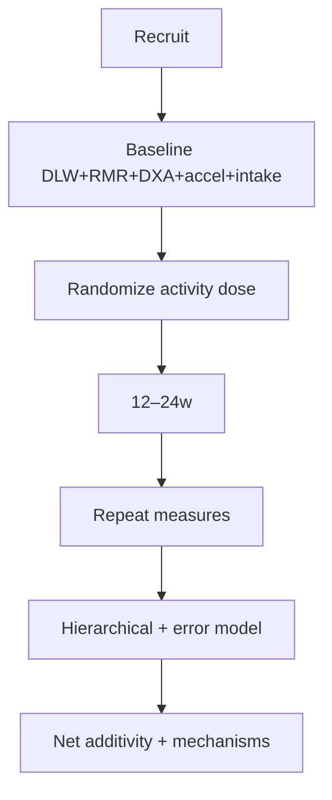


# 8. Translation to hypertrophy-preserving cuts in midlife

DLW implies constraints: adult stability, compensation, weak short-horizon predictiveness, high variance. Therefore design cuts as robust control systems.

## 8.1 Decision hierarchy
1) Preserve training quality and hypertrophy signal  
2) Diet-driven deficit small enough to sustain quality  
3) Stabilize NEAT to prevent drift  
4) Trend-based adjustments

### Figure 17. Cut as control system
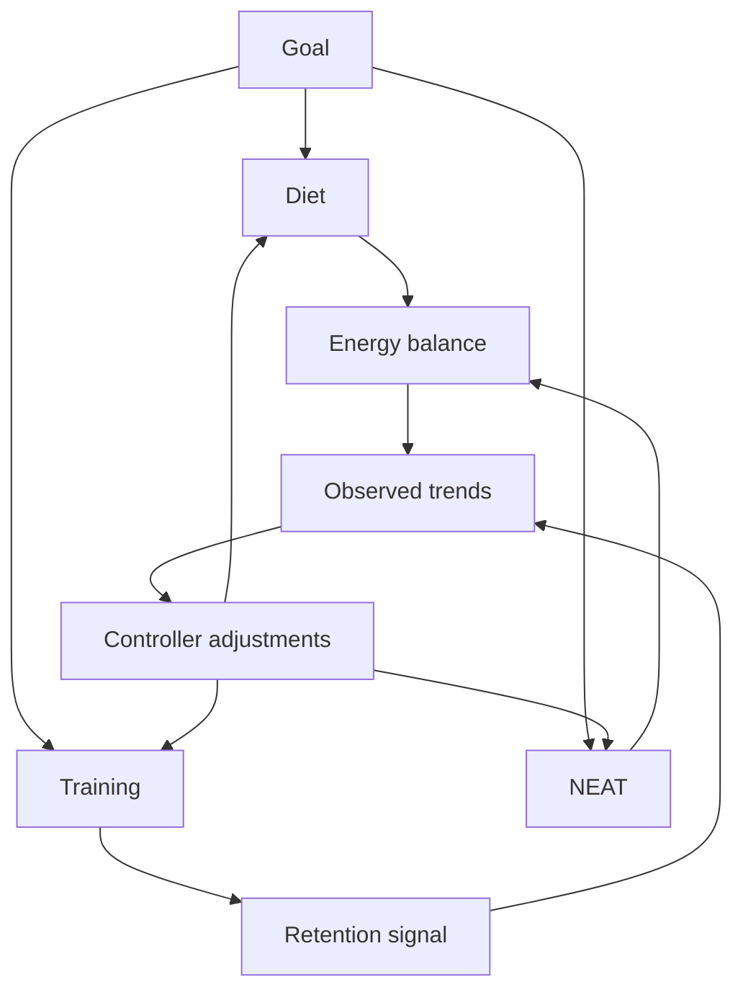

## 8.2 Training design
Use performance anchors; reduce junk volume; protect joint tolerance (knee OA as constraint).

### Table 14. Training priorities
| Goal | Maintain | Reduce | Red flags |
|---|---|---|---|
| Retention | anchor performance | junk volume | 2w drop |
| Joint | stable ROM | impact | pain ↑ |
| Deficit | sustainable fatigue | overreach | steps drift |
| Adherence | simplicity | novelty | missed sessions |

## 8.3 Nutrition structure
Diet drives deficit; don’t eat back exercise calories by default; place carbs around training; protein high.

### Table 15. Diet rules
| Problem | Naïve | Robust |
|---|---|---|
| Add cardio | eat back | hold intake; trends decide |
| Stall | add exercise | audit intake+NEAT |
| Hunger | white-knuckle | structure meals |
| Performance | ignore | reduce deficit/retime carbs |

## 8.4 Progress metrics
Track 7–14d weight trend, weekly waist, steps/bike medians, performance anchors, knee symptoms.

### Figure 18. Dashboard logic
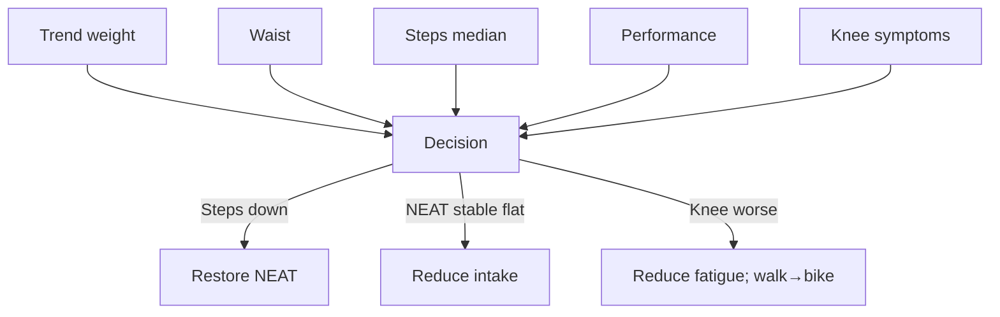

## 8.5 Adjustment rules

### Table 16. Control rules
| Trigger | Driver | First | Second |
|---|---|---|---|
| Steps ↓ | drift | add NEAT | small diet cut |
| Flat trends | intake | −150–250 kcal | add NEAT |
| Performance ↓ | recovery | reduce deficit | deload |
| Knee ↑ | overload | walk→bike | review |

